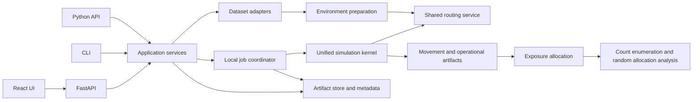

# Software Architecture

MR43 OSM acquisition refinement: one environment job requests all selected OSM spatial-feature categories through one deterministic union of their tag predicates, retains only the tags required for exact local category recovery, and aggregates each recovered category with the existing scientific rules. Large road regions initially target four tiles instead of eight; failures still trigger bounded recursive subdivision, cache every complete response and publish no partial network. Public Overpass requests remain serial.

MR28–MR30 preparation refinement: workbench Validate performs configuration checks only. Full `resolve_project` remains part of Run. Disposable JSON stage caches restore the exact semantic seed records and resolved locations alongside typed outputs; persistent scalar road-cost shards retain directed identity and profile hashes. Preparation can use at most four source-search threads sharing one prepared graph, bounded by the requested worker count and conservative working-memory allowance. Replication assembly and OR-Tools search remain sequential and deterministic; no nested replication process pool is introduced. This deliberately places concurrency at the measured road-cost bottleneck instead of duplicating the entire environment per replication.

Status: current public architecture for version 0.1.0. The launcher supervises independent named project stores, while the flat headless artifact layout remains supported for Python and CLI workflows.

## 1. Authority and reading order

The immutable scientific authority is [MOBILE_SENSING_FRAMEWORK.tex](MOBILE_SENSING_FRAMEWORK.tex). Its SHA-256 at architecture review is `bb13176affcfe6060747336e75f6345eb93f7e84c176db3b8c50dcf08030ad83`. Do not edit it. The decisions below resolve implementation details it leaves open; they do not replace its model.

Read the documents in this order:

1. The framework, then this architecture.
2. [INTERFACES.md](INTERFACES.md): identifiers, schemas, artifact tables, APIs, and extension contracts.
3. [SIMULATION_SPECIFICATION.md](SIMULATION_SPECIFICATION.md): event semantics, execution, routing, and exposure.
4. [DATA_INGESTION_SPECIFICATION.md](DATA_INGESTION_SPECIFICATION.md): uploads, Lausanne, and GTFS reconstruction.
5. [PORTFOLIO_SPECIFICATION.md](PORTFOLIO_SPECIFICATION.md): count enumeration, random allocation, sample statistics, and budget frontiers.
6. [UI_SPECIFICATIONS.md](UI_SPECIFICATIONS.md): frontend behavior and supported controls.
7. [IMPLEMENTATION_PLAN.md](IMPLEMENTATION_PLAN.md) for current maintenance and extension priorities.

The interface document owns names and serialized fields; scientific specifications own their mathematical meaning. A conflict between these new documents requires a documented resolution before dependent implementation. The old README, old tests, and legacy source are evidence of existing behavior, not alternative specifications. Missing files referenced by the README are not implementation dependencies.

## 2. Product boundary

The product is a local, single-user research application with three entry points into the same application services: an importable Python package, a CLI, and a browser UI. Simulation generates complete operations for a fixed physical vehicle population and retains each vehicle's sensing-duration matrix in every replication. Portfolio analysis enumerates fleet sensor counts and randomly samples concrete vehicles because installation identities are unknown; it never changes operational supply or reruns mobility as a side effect.

The first release must provide a complete vertical workflow: import or generate inputs, validate a scenario, run replications, inspect operations and sensing, enumerate/evaluate sensor-count portfolios by random allocation, and export reproducible artifacts. A single replication is valid for deterministic debugging or allocation analysis conditional on one realization; operational variability estimates require additional replications. Portfolio sampling variability uses J rounds as defined in its specification.

Out of scope: authentication, collaboration, distributed/cloud execution, endogenous congestion, ride pooling, mutable multi-task vehicle plans, TSP/VRP optimization, arbitrary uploaded executable plugins, calibrated behavioral models, and real-time GPS assimilation. Future policies must use the extension boundaries rather than introduce fleet-specific kernels.

## 3. Decisions

| Concern | Decision | Rationale / boundary |
|---|---|---|
| Backend | Python 3.12 initial supported runtime; Pydantic v2 for strict external contracts; dataclasses/arrays for hot runtime state | Reuse the repository's Python/geospatial ecosystem without web dependencies in the core. Test additional Python versions before advertising support. |
| Scientific package | New `src/mobile_sensing/` namespace, with explicit domain subpackages | Legacy top-level packages have incompatible contracts and remain isolated during migration. This is one package, not microservices. |
| Simulation | One deterministic heap-based discrete-event kernel | A small custom scheduler makes simultaneous events and task execution explicit; no need for a second scheduling framework. |
| Routing | Directed multigraph, NetworkX baseline Dijkstra, replaceable routing interface | Keep parallel-edge identity and route timing consistent between dispatch and execution. Use bounded source-tree/path caches. |
| Supplied-road defects | Immutable raw input plus versioned diagnosis/repair/quarantine before strict prepared-network validation | Conservative repair may split component linework and conflicting endpoint identities only under proved local conditions. Every derived edge/node retains lineage; unresolved records remain inspectable and scenario-scoped impact is explicit. |
| Spatial processing | GeoPandas, Shapely, PyProj; EPSG:2056 for Lausanne calculations | Metric geometry for snapping, lengths, and intersections; EPSG:4326 only for map exchange. |
| Numerical data | NumPy/SciPy, PyArrow Parquet datasets | Sparse vehicle exposure and partitioned results; no dense replication × vehicle × grid × time default. |
| Portfolio | Resolution-controlled count enumeration, bounded uniform vehicle sampling, mean/std, budget-specific Pareto frontiers | Each point is a count portfolio summarized over random installation/operational draws; a point inspector exposes actual sampled vehicles. No optimizer or solver dependency is required. |
| HTTP | FastAPI + Uvicorn; REST and SSE | Typed APIs, schema generation, persistent progress and ordinary request semantics. |
| Long jobs | Separate local coordinator process with a bounded process pool using spawn | CPU-heavy work must not occupy the API event loop. Pool children run scientific functions, not API handlers. |
| Metadata | SQLite in WAL mode on local disk | Projects, revisions, uploads, jobs, events, and artifact references. No analytical matrices or movement rows in SQLite. |
| Artifact store | Immutable directories with JSON manifests and Parquet/GeoParquet tables | Auditable dependencies, atomic publication, and Python/CLI reuse without a running API. |
| Frontend | React + TypeScript + Vite; MUI; React Hook Form; TanStack Query; MapLibre GL JS; Plotly.js | Matches the existing UI direction while supporting responsive research workflows. No Streamlit, Dash, or Panel implementation. |
| Frontend state | TanStack Query for server state, form state for edits, URL for shareable filters; small Zustand store only for cross-page ephemeral state | Do not keep three independent copies of a project configuration. |
| Packaging | Retain Poetry and the existing lock workflow; npm with one frontend lockfile | Avoid an unrelated packaging migration. Freeze tested versions during M00 rather than perpetuate old conflicting pins. |
| Serving | Development: Vite proxy to API. Local release: FastAPI serves built static UI on the same origin | Node is needed for building the UI, not for running the scientific package or an already built UI. |

These are project choices. FastAPI's documentation distinguishes heavy compute from small background tasks; the separate worker is our local deployment response to that distinction. See [FastAPI background tasks](https://fastapi.tiangolo.com/tutorial/background-tasks/). Vite currently specifies Node 20.19+ or 22.12+; use a tested Node 22 release at least 22.12 for the initial build and record its exact version. See [Vite requirements](https://vite.dev/guide/). Verify dependency compatibility at implementation time and commit locks; do not install unbounded `latest` dependencies in reproducible instructions.

## 4. Component and dependency structure



Planned package layout, not files to create during architecture design:

```text
src/mobile_sensing/
  contracts/       versions, configuration, records, validation issues, protocols
  environment/     graph, grid, spatial indices, travel-time profiles, routing
  datasets/        upload normalization, demand adapters, GTFS, Lausanne adapters
  simulation/      kernel, task pool, executor, dispatch, supply, operational policies
  exposure/        edge-grid pieces, interval allocation, reaggregation
  portfolio/       utility, count enumeration, random allocation, sample statistics, Pareto
  artifacts/       manifests, Parquet I/O, checksums, immutable publication
  application/     use cases and dependency wiring shared by CLI and API
  jobs/            local scheduler, coordinator, worker entry points, cancellation
  api/             routes, SSE, request/response mapping, bounded result queries
  cli/             explicit command entry points
frontend/src/
  app/             shell, routing, providers
  features/        projects, environment, fleets, imports, simulation, portfolio, results
  components/      forms, maps, tables, charts, status, layout
  api/             generated types, client, query keys
  state/           narrowly scoped UI-only state
tests/          contract, scientific, integration, job, and migration tests
```

`contracts` has no imports from domain implementations or web/storage adapters. Domain modules depend on contracts and their explicitly needed domain services: simulation may use environment routing; exposure may use prepared environment geometry; portfolio consumes exposure contracts and readers, never a simulation runner. Dataset preparation does not start a simulation. Application services orchestrate; CLI/API translate requests. Core functions receive data, RNG streams, progress callbacks, and cancellation interfaces explicitly; they do not read global project state or environment variables.

The M05A implementation freezes `event-kernel@1` as the single heap and state-lifecycle owner. Eligibility, dispatch, routing, execution-plan construction, and operational task generation enter through typed seams and do not add alternate kernels. Heap events retain the four serialized phases; dispatch and operational-policy evaluation are synchronous decision phases after the timestamp snapshot is closed.

M05B fills the existing decision seam with `generic-task-executor@1`, `dispatch.predefined@1`, and `dispatch.nearest_matching@1`. Eligibility and plan construction share one bounded route cache and the M04 scheduled-task timing primitive. Cutoff materialization is part of the execution outcome and records either an actual location or a directed edge fraction; it never commits the planned endpoint early. M05C fills the same seam with `operational.random_cruise@2` and `operational.depot_return@1`; stationary idle intervals are closed by the common kernel without periodic ticks. Depot returns use the generic task executor. Random cruise creates one bounded operating execution across the directed edges traversed between consecutive decision epochs; it retains exact movement but does not create demand outcomes or persisted operational events. No fleet-specific or operational event loop exists.

M06 persists the common kernel output as immutable coarse replication-partitioned Parquet tables. `ordered-edge-grid@1` decomposes directed movement geometry into complete ordered in-grid/outside fraction pieces, and `exact-interval-exposure@1` intersects these pieces with movement and reporting intervals. Exposure remains sparse at physical-vehicle resolution; complete catalog/replication/axis manifests certify logical zero matrices. Derived grid/bin artifacts read retained movement and do not invoke the kernel. Sparse readers stream bounded Arrow batches with replication and vehicle predicate selection; aggregate statistics sum vehicles inside each replication before reducing across replications.

M07 adds a synchronous `application` orchestration boundary and one-to-one CLI adapters for local environment preparation, managed tabular upload, demand/supply normalization, GTFS reconstruction, scenario validation, sequential simulation, and exposure allocation. These paths invoke the same domain modules and immutable stores without SQLite, HTTP, or a browser. Scenario validation verifies supplied dataset artifacts, resolves one stable cross-fleet physical catalog and joint replication set, records semantic RNG manifests, checks finite route impact, and carries explicit synthetic/inferred/uncalibrated assumptions. M09 subsequently adds deterministic multi-process execution and durable jobs without changing this application or kernel boundary.

M08A adds `portfolio` as a strict downstream consumer of verified complete exposure artifacts. It verifies the exposure-to-simulation joint identity, enumerates bounded count vectors, and uses semantic round streams to draw one joint replication plus full fleet permutations. Count prefixes are shared across portfolios. Sparse sample matrices and exact vehicle/round lineage are atomically published; no portfolio path imports or invokes the mobility kernel. Operational replications `R` and allocation rounds `J` remain separate metadata and table axes. Statistical summaries and frontiers remain M08B.

M09 implements the local process boundary. The FastAPI process commits requests and serves bounded projections but never owns scientific workers. One filesystem-locked coordinator owns transactional leases and final publication. Ordinary jobs use its bounded spawn pool; simulations submit replication tasks directly to a coordinator-owned spawn pool, avoiding nested pools. Children reconstruct and cache verified prepared routing state, return complete replication results, and never mutate SQLite or publish simulation manifests. Deterministic worker-count comparisons operate on normalized kernel results; worker count remains excluded from scientific identity.

M10 implements the browser configuration boundary in `frontend/`. TanStack Query owns server state, form/component state owns the mutable draft, React Router owns page URLs, and local storage retains only the active project and browser-observed job/revision associations. Full revision payloads and project-filtered job history are reloaded from the server. HTTP adapters parse JSON arrays and ISO datetimes in JSON mode before handing immutable strict models to application services; scientific contract strictness is unchanged. Import and GTFS jobs whose page-local inputs are not part of a saved revision are explicitly left without a revision label. Portfolio controls keep operational `R`, sampling `J`, count levels, costs, budgets, and reporting intervals separate and never trigger mobility from field edits.

The browser result boundary streams verified Parquet into capped table, WGS84 map, operation-summary, matrix-summary, and budget-frontier projections; full exports remain durable jobs. Matrix totals and time summaries are calculated server-side by summing selected physical vehicles/cells within each replication or portfolio round before empirical reduction, preserving covariance. The UI receives bounded sparse slices and scalar/vector summaries only. Operational `R`, selected-replication cardinality, and portfolio sampling `J` are distinct response fields. MapLibre uses an offline blank style and Plotly loads a browser-only basic bundle lazily; tables remain usable without WebGL.

M12 closes the local release boundary. Vite emits hashed static files into `src/mobile_sensing/_web/`; Poetry includes that directory in both wheel and source distributions. `mobile-sensing launch` creates one coordinator child process and serves the installed UI and API from one FastAPI origin. Node is strictly a source-build dependency and is absent from the accepted runtime path. The SPA fallback is installed after API routes, and unknown `/api/` paths remain JSON 404 responses. Core package import does not import web dependencies; only API and launcher entry points require the `web` extra.

The launcher requires an explicit coordinator readiness message after exclusive-lock acquisition and pool construction, before starting the API. Startup failure or timeout propagates to the launcher; unexpected coordinator exit stops the API. These process controls do not alter scientific configuration or artifact identity. Release measurements report traced Python memory and process RSS separately; the execution working-budget estimate is not an OS-enforced RSS cap.

Use registry keys such as `dispatch.nearest_matching@1` with a bounded, installed registry. Capabilities and parameter schemas come from the same registry. Fleet names are display metadata; they are never dispatch keys for simulator classes. Fleet membership remains an explicit eligibility boundary in v1. All fleets execute within one replication and share its environment and scenario realization.

Reserve an `EnvironmentProvider` boundary for future region selection, grid generation, and geographic/network retrieval, including OpenStreetMap. Local-file preparation is the first implementation. A future OSM provider must return the same normalized environment inputs with query polygon, retrieval timestamp, raw-response hashes, attribution, travel-mode filters, and cache metadata. It must not introduce an OSM-dependent simulator. Provider jobs use the existing persistent job model; remote retrieval is explicit, cancellable, and cached. The offline example never invokes it. See the data specification for the planned contract and UI capability behavior.

## 5. Persistence and dependency invalidation

The artifact root is a user-selected local directory, distinct from immutable `data/` and `ref/`. Proposed internal layout:

```text
workspace/
  metadata.sqlite
  raw_inputs/<dataset_id>/
  datasets/<dataset_id>/
  environments/<environment_id>/
  simulations/<simulation_id>/
  exposures/<exposure_id>/
  portfolios/<analysis_id>/
  exports/<export_id>/
  staging_uploads/<staging_id>/
  .job-control/<job_id>/<attempt_token>/
```

IDs identify published objects or executions. A separate content fingerprint identifies equivalent scientific inputs. A manifest records schema/algorithm versions, dependency hashes, resolved configuration, random stream keys, runtime versions, warnings, row counts, partition completion, and checksums. Timestamps and worker count are recorded but excluded from scientific identity. Absolute source paths are provenance, not portable identity.

Use atomic rename on the same filesystem after all expected partitions validate. Incomplete staging output is never a completed scientific artifact. Each attempt has its own ID; a successful cache hit explicitly returns the existing artifact reference. Retrying failed attempts cannot silently combine their partial replications. No implicit partial-data portfolio analysis.

| Edit | Recompute | Reuse |
|---|---|---|
| Raw task data, supply population, shift windows, demand seed, dispatch/cruising policy, network/travel times, simulation horizon | Mobility and downstream exposure/analysis | Independent unchanged input preprocessing |
| Grid or reporting bins, with movement retained | Exposure and analysis | Mobility |
| Sensor-active movement categories | Exposure and analysis | Mobility |
| Utility weights/saturation, fleet cost, budget list, count resolution, sampling rounds/seed | Portfolio analysis | Mobility and exposure; compatible existing sample matrices/evaluations |
| Map layer, time filter, display palette, worker count | Display or execution settings only | Scientific artifacts |

Environment identity is factored into routing/network and sensing/spatial identities. A combined UI environment snapshot may reference both; changing its grid must not invalidate the mobility fingerprint. Supplying an alternate demand location via a grid does affect mobility because the normalized task coordinates change.

## 6. Job lifecycle and failure handling

Use `queued → initializing → running → finalizing → completed`, with `failed` or `cancelled` terminal alternatives. `cancel_requested` is a persisted flag, not successful cancellation. Each job has a kind: import, environment preparation, GTFS reconstruction, simulation, exposure, or portfolio. The API returns 202 and a job reference after committing submission.

One coordinator claims jobs transactionally using a lease and attempt token. Initially run one heavy job at a time; parallelize its replications inside a bounded pool. The API and coordinator use separate SQLite connections with short transactions; pool children never mutate job metadata. Each child writes a distinct partition and reports status to the coordinator. Coordinator lease tokens fence stale workers from publishing. Use a filesystem/local-workspace lock to prevent a second coordinator owning the same queue.

Persist phase changes and completed-replication/sample counts. SSE is a read projection of durable job events, not the only source of status. Reconnection uses event IDs; browser closure does not cancel a run. Cancellation is checked at event batches, routing batches, import chunks, and portfolio sample batches. On coordinator death, its expired in-flight attempts become failed with `worker_lost`; explicit retry begins a new attempt. v1 does not promise mid-replication resume. On application shutdown request cancellation, allow a bounded grace period, then terminate only owned worker processes. A queued job can be cancelled atomically without spawning a child.

The metadata schema also persists projects, immutable full revisions, idempotency keys, bounded job events, API resource reservations, and resource dependencies. Analytical tables remain in checksum-verified immutable artifacts. Result cursors bind artifact content, table, and filters; table scans are batch-bounded. Map geometry is transformed to WGS84 only in the API projection.

Cap automatic workers by CPU count and an explicit memory budget based on measured prepared-graph/replication memory. Default conservatively to one worker before profiling. Avoid copying the graph per task: initialize it once per process from a prepared artifact. Cap BLAS threads inside replication workers and avoid nested process pools.

## 7. Reference and compatibility boundary

Only `src/mobile_sensing/` is production Python. The `ref/` directory is read-only methodological material and is neither imported nor executed by production code. Retired version-1 taxonomy simulators, moment approximations, and label-coupled supply semantics are intentionally absent; current fixtures retain the replacement-coverage audit.

## 8. Release acceptance

The release is complete only when all milestones in the implementation plan pass and the final workflow runs with local Lausanne data and disabled external network access. No claims of empirical calibration or globally optimal portfolio search unless the relevant evidence is actually present. Numerical invariants, cohort alignment, artifact completeness, cancellation, and frontend/back-end contract consistency are release criteria; a screenshot or a passing import test is insufficient.

Performance gates are measured on a recorded reference machine, with cold/warm preparation and peak memory reported separately. Enforce bounded query sizes and user-visible resource limits from the first version; larger-scale optimizations follow measured bottlenecks rather than speculative infrastructure.
